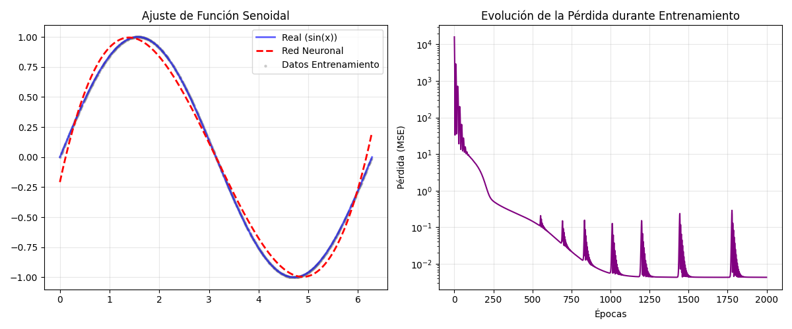

# Proyecto PyTorch: Ajuste de Función Senoidal

Este proyecto implementa una red neuronal simple desde cero utilizando **PyTorch** para aprender y aproximar la función no lineal $y = \sin(x)$.

El código sigue un enfoque orientado a objetos y realiza un ciclo de entrenamiento manual para demostrar los fundamentos del aprendizaje profundo: tensores, autograd, funciones de pérdida y optimizadores.

---

## 📋 Tabla de Contenidos
- [Descripción](#Descripción)
- [Requisitos](#Requisitos)
- [Instalación y Ejecución](#Instalación-y-Ejecución)
- [Estructura del Código](#Estructura-Del-Código)
- [Resultados](#Resultados)
- [Autor](#Autor)

---

## 📖 Descripción

El objetivo principal es familiarizarse con el flujo de trabajo en PyTorch. El proyecto consiste en una clase `ModeloSenoidal` que encapsula las siguientes etapas:

1.  **Generación de Datos:** Crea un dataset sintético de la función seno en el intervalo $(0, 2\pi)$ con mezcla aleatoria (shuffling) para evitar sobreajuste.
2.  **Arquitectura:** Una red neuronal `Feed-Forward` con una capa oculta y función de activación `HamiltonianActivation`.
3.  **Entrenamiento Manual:** Implementación paso a paso del ciclo de entrenamiento (Forward pass, cálculo de Loss, Backward pass y actualización de pesos).
4.  **Evaluación:** Visualización de la curva de predicción vs. real y la convergencia de la pérdida (MSE).

---

## 🛠 Requisitos

El proyecto utiliza las siguientes librerías:
* **Python 3**
* **PyTorch** (Cálculo de tensores y redes neuronales)
* **NumPy** (Manejo de arrays y generación de datos)
* **Matplotlib** (Visualización de resultados)

---

## 🚀 Instalación y Ejecución

1.  **Clonar el repositorio:**
    ```bash
    git clone <https://github.com/pacobanadia/Repositorio_Programacion.git>
    ```

2.  **Instalar dependencias:**
    Si no tienes las librerías instaladas, ejecuta:
    ```bash
    pip install torch numpy matplotlib
    ```

3.  **Ejecutar el modelo:**
    ```bash
    python modelo_senoidal.py
    ```
    Al finalizar, se generará una imagen `prediccion_vs_real.png` y un archivo de modelo `modelo_senoidal.pth`.

---

## 🧩 Estructura del Código

El script `modelo_senoidal.py` contiene la clase `ModeloSenoidal` con los siguientes métodos clave:

| Método | Descripción |
| :--- | :--- |
| `generar_datos()` | Crea tensores de entrenamiento (80%) y validación (20%) a partir de `np.sin(x)`. |
| `construir_modelo()` | Define la red: `Linear(1->20)` -> `HamiltonianActivation` -> `Linear(20->1)`. |
| `entrenar()` | Ejecuta el ciclo por 2000 épocas usando **MSELoss** y el optimizador **Adam** (LR=0.01). |
| `graficar_resultados()` | Genera la comparativa visual y la gráfica de pérdida. |
| `guardar_modelo()` | Exporta los pesos entrenados (`state_dict`) a un archivo `.pth`. |

---

## 📊 Resultados

El modelo logra converger exitosamente, reduciendo el Error Cuadrático Medio (MSE) significativamente.

### Gráfica de Predicción y Pérdida


* **Izquierda:** Se observa cómo la red neuronal (línea roja punteada) se ajusta casi perfectamente a la función senoidal real (línea azul).
* **Derecha:** Muestra la disminución de la función de pérdida (MSE) a lo largo de las épocas (escala logarítmica). *Nota: Los pequeños picos al final se deben a la alta sensibilidad del optimizador Adam en valores de error muy bajos.*

---

## ✒️ Autor

**Daniel Cano Duque**
* Entregable 1 - Programación 2026
* Proyecto: Entrenamiento de una red neuronal simple.